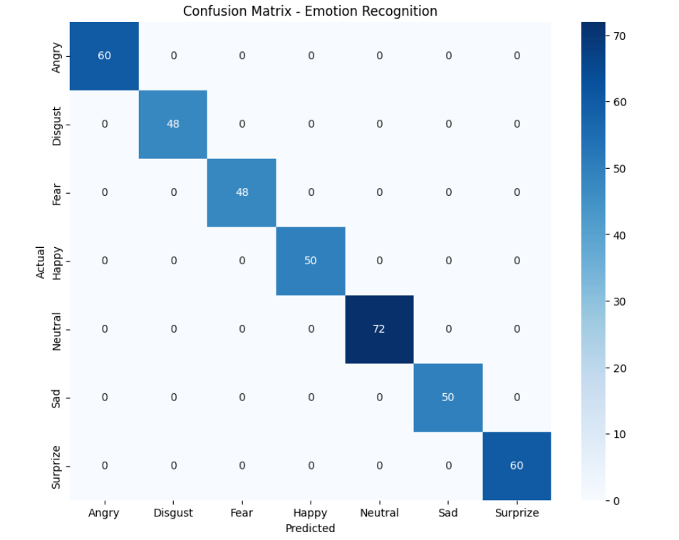

<p align="center">
  
  
  
  
  
</p>

<h1 align="center">Multimodal Depression Detection System</h1>

<p align="center">
  <b>A machine learning pipeline combining Facial Expression Analysis, EEG Signal Processing, and Audio Feature Extraction for comprehensive depression screening</b>
</p>

<p align="center">
  
  
  
  
</p>

---

## Table of Contents

- [Overview](#overview)
- [Architecture](#architecture)
- [Modality 1: Facial Expression Analysis](#modality-1-facial-expression-analysis)
- [Modality 2: EEG-Based Detection](#modality-2-eeg-based-detection)
- [Modality 3: Audio-Based Detection](#modality-3-audio-based-detection)
- [Multimodal Fusion](#multimodal-fusion)
- [Installation](#installation)
- [Usage](#usage)
- [Results](#results)
- [Project Structure](#project-structure)
- [Future Work](#future-work)
- [References](#references)
- [License](#license)

---

## Overview

Depression is a critical mental health condition affecting millions worldwide. Early detection is crucial for timely intervention. This project implements a **trimodal approach** that combines:

| Modality | Data Source | Analysis Type | Indicators |
|----------|-------------|---------------|------------|
| **Facial Expression** | Video Frames | Visual Emotion Recognition | Sad, Neutral, Fear patterns |
| **EEG Signals** | Brain Activity | Neurophysiological Patterns | Low valence states |
| **Audio/Speech** | Voice Recordings | Acoustic Feature Analysis | Pitch, energy, vocal quality |

By fusing insights from **behavioral** (facial expressions), **physiological** (brain signals), and **vocal** (speech patterns) indicators, the system provides a robust and comprehensive depression screening mechanism.

---

## Architecture

```
+===============================================================================+
|                    MULTIMODAL DEPRESSION DETECTION SYSTEM                      |
+===============================================================================+
|                                                                               |
|  +-------------------------+  +-------------------------+  +----------------+ |
|  |   MODALITY 1: VIDEO     |  |   MODALITY 2: EEG       |  | MODALITY 3:    | |
|  |                         |  |                         |  |    AUDIO       | |
|  |  +-------------------+  |  |  +-------------------+  |  | +------------+ | |
|  |  | Video Input(.mp4) |  |  |  | EEG Signals(32Ch) |  |  | |Audio(.wav) | | |
|  |  +---------+---------+  |  |  +---------+---------+  |  | +-----+------+ | |
|  |            |            |  |            |            |  |       |        | |
|  |            v            |  |            v            |  |       v        | |
|  |  +-------------------+  |  |  +-------------------+  |  | +------------+ | |
|  |  | Frame Extraction  |  |  |  | Band-Pass Filter  |  |  | | Feature    | | |
|  |  | (Every 5th Frame) |  |  |  | (0.5 - 45 Hz)     |  |  | | Extraction | | |
|  |  +---------+---------+  |  |  +---------+---------+  |  | | (41 feats) | | |
|  |            |            |  |            |            |  | +-----+------+ | |
|  |            v            |  |            v            |  |       |        | |
|  |  +-------------------+  |  |  +-------------------+  |  |       v        | |
|  |  | Preprocessing     |  |  |  | Feature Extract   |  |  | +------------+ | |
|  |  | - Grayscale       |  |  |  | - Time Domain     |  |  | | - MFCCs    | | |
|  |  | - Resize (48x48)  |  |  |  | - Frequency Domain|  |  | | - Pitch    | | |
|  |  | - Flatten (2304)  |  |  |  |   (d,0,a,B bands) |  |  | | - Jitter   | | |
|  |  | - StandardScaler  |  |  |  | - StandardScaler  |  |  | | - Energy   | | |
|  |  +---------+---------+  |  |  +---------+---------+  |  | +-----+------+ | |
|  |            |            |  |            |            |  |       |        | |
|  |            v            |  |            v            |  |       v        | |
|  |  +-------------------+  |  |  +-------------------+  |  | +------------+ | |
|  |  |Logistic Regression|  |  |  |Logistic Regression|  |  | |Log. Regr. | | |
|  |  | (7-Class Emotion) |  |  |  | (Binary: Dep/Not) |  |  | |(Binary)   | | |
|  |  +---------+---------+  |  |  +---------+---------+  |  | +-----+------+ | |
|  |            |            |  |            |            |  |       |        | |
|  |            v            |  |            v            |  |       v        | |
|  |  +-------------------+  |  |  +-------------------+  |  | +------------+ | |
|  |  | Depression Ratio  |  |  |  | Depression Label  |  |  | | Depression | | |
|  |  |(Sad+Neut+Fear)/   |  |  |  | (0: No, 1: Yes)   |  |  | | Label      | | |
|  |  | Happy             |  |  |  |                   |  |  | | (0 or 1)   | | |
|  |  +---------+---------+  |  |  +---------+---------+  |  | +-----+------+ | |
|  |            |            |  |            |            |  |       |        | |
|  +------------|------------+  +------------|------------+  +-------|--------+ |
|               |                            |                       |          |
|               +----------------------------+-----------------------+          |
|                                            |                                  |
|                                            v                                  |
|                         +----------------------------------+                  |
|                         |        MULTIMODAL FUSION         |                  |
|                         |   Weighted Voting / Averaging    |                  |
|                         +----------------+-----------------+                  |
|                                          |                                    |
|                                          v                                    |
|                         +----------------------------------+                  |
|                         |         FINAL OUTPUT             |                  |
|                         |  - High Depressive Indicators    |                  |
|                         |  - Moderate Risk                 |                  |
|                         |  - Low Risk / Normal             |                  |
|                         +----------------------------------+                  |
|                                                                               |
+===============================================================================+
```

---

## Modality 1: Facial Expression Analysis

### Phase A: Training Pipeline

Trains a Logistic Regression model to recognize 7 emotions from static facial images.

#### Dataset
- **Source:** [Kaggle - DepVidMood Facial Expression Dataset](https://www.kaggle.com/datasets/ziya07/depvidmood-facial-expression-video-dataset)
- **Emotions:** Angry, Disgust, Fear, Happy, Neutral, Sad, Surprise

#### Preprocessing Pipeline

```
Raw Image --> Grayscale --> Resize(48x48) --> Flatten(2304) --> StandardScaler
```

| Step | Operation | Input | Output |
|------|-----------|-------|--------|
| 1 | Grayscale Conversion | RGB (3 channels) | Gray (1 channel) |
| 2 | Resizing | Variable size | 48 x 48 pixels |
| 3 | Flattening | 2D Matrix (48x48) | 1D Vector (2304) |
| 4 | Scaling | Raw pixels | Normalized (mean=0, var=1) |

#### Model Configuration

```python
LogisticRegression(
    solver='lbfgs',
    multi_class='multinomial',
    max_iter=1000
)
```

### Phase B: Video Analysis Pipeline

Applies the trained model to video files for depression screening.

```
Video (.mp4) --> Frame Extraction --> Preprocessing --> Inference --> Aggregation --> Depression Score
```

#### Depression Heuristic

$$\text{Depression Ratio} = \frac{\text{Sad} + \text{Neutral} + \text{Fear}}{\text{Happy} + 1}$$

| Ratio | Classification |
|-------|----------------|
| > 2.0 | High Depressive Indicators |
| <= 2.0 | Normal/Balanced Affect |

---

## Modality 2: EEG-Based Detection

### Dataset: DEAP

| Specification | Value |
|---------------|-------|
| **Subjects** | 32 |
| **Trials/Subject** | 40 |
| **EEG Channels** | 32 |
| **Sampling Rate** | 128 Hz |
| **Labels** | Valence, Arousal, Dominance, Liking |

### Depression Labeling Strategy

Since clinical labels are unavailable, we use **valence-based proxy labeling**:

| Valence | Label | Class |
|---------|-------|-------|
| <= 4 | 1 | Depressed |
| > 4 | 0 | Non-Depressed |

Low valence values are strongly associated with negative emotional states commonly linked to depression.

### Signal Processing Pipeline

#### 1. Band-Pass Filtering
```
Butterworth Filter: 0.5 Hz - 45 Hz
Purpose: Remove noise, baseline drift, high-frequency artifacts
```

#### 2. Feature Extraction

**Time-Domain Features:**
- Mean amplitude
- Variance

**Frequency-Domain Features (Welch PSD):**

| Band | Frequency Range | Associated State |
|------|-----------------|------------------|
| **Delta** | 0.5 - 4 Hz | Deep sleep |
| **Theta** | 4 - 8 Hz | Drowsiness, meditation |
| **Alpha** | 8 - 13 Hz | Relaxation, calm |
| **Beta** | 13 - 30 Hz | Active thinking, focus |

### Model Configuration

```python
LogisticRegression(
    penalty='l2',
    class_weight='balanced',
    max_iter=1000
)
```

### Training Strategy

| Parameter | Value |
|-----------|-------|
| Train/Test Split | 80/20 |
| Stratification | Yes |
| Scaling | StandardScaler |
| Missing Values | Mean Imputation |

---

## Modality 3: Audio-Based Detection

### Dataset

- **Primary:** DAIC-WOZ (PHQ-8 score >= 10 = Depressed)
- **Fallback:** RAVDESS emotional speech dataset
  - Sad/Fearful emotions --> Depressed
  - Neutral/Calm/Happy emotions --> Healthy

### Audio Processing Pipeline

```
Audio (.wav) --> Load (22050 Hz) --> Feature Extraction (41 features) --> SMOTE --> StandardScaler --> Classification
```

### Feature Extraction (41 Features)

| Category | Features | Count | Clinical Relevance |
|----------|----------|-------|-------------------|
| **Spectral (MFCCs)** | MFCC 1-13 Mean and Std | 26 | Vocal tract shape, speaking style |
| **Prosodic** | Pitch Mean, Std, Range | 3 | Reduced variation in depression |
| **Voice Quality** | Jitter, Shimmer | 2 | Voice instability indicators |
| **Temporal** | ZCR Mean/Std, RMS Mean/Std | 4 | Speech dynamics and energy |
| **Additional Spectral** | Centroid, Bandwidth, Rolloff | 6 | Spectral characteristics |

### Key Clinical Indicators

| Feature | Direction in Depression | Clinical Meaning |
|---------|------------------------|------------------|
| Pitch_Std | Decrease | Monotone speech |
| Pitch_Range | Decrease | Limited emotional expression |
| RMS_Mean | Decrease | Lower vocal energy |
| Jitter | Increase | Voice instability |

### Model Configuration

```python
LogisticRegression(
    solver='liblinear',
    class_weight='balanced',
    max_iter=1000
)
```

### Data Preprocessing

- Handle NaN/Infinite values with median imputation
- Apply SMOTE if class imbalance ratio > 1.5 (training data only)
- StandardScaler normalization

---

## Multimodal Fusion

The system combines predictions from all three modalities for robust assessment:

```
                    +-------------------+
                    |  Video Analysis   | --> Depression Ratio --> Score_1
                    +-------------------+
                             |
                             v
+-------------------+   +-------------------+   +-------------------+
|  Facial Score     |   |   EEG Score       |   |   Audio Score     |
|  (0.0 - 1.0)      |   |   (0.0 - 1.0)     |   |   (0.0 - 1.0)     |
+---------+---------+   +---------+---------+   +---------+---------+
          |                       |                       |
          +-----------------------+-----------------------+
                                  |
                                  v
                    +----------------------------+
                    |     FUSION STRATEGIES      |
                    | 1. Weighted Average        |
                    | 2. Majority Voting         |
                    | 3. Confidence-Based        |
                    +-------------+--------------+
                                  |
                                  v
                    +----------------------------+
                    |      RISK ASSESSMENT       |
                    +----------------------------+
```

### Fusion Strategy

| Facial | EEG | Audio | Final Output |
|--------|-----|-------|--------------|
| High | Depressed | Depressed | **Confirmed High Risk** |
| High | Depressed | Non-Dep | **High Risk** |
| High | Non-Dep | Depressed | **High Risk** |
| High | Non-Dep | Non-Dep | **Moderate Risk** |
| Normal | Depressed | Depressed | **High Risk** |
| Normal | Depressed | Non-Dep | **Moderate Risk** |
| Normal | Non-Dep | Depressed | **Moderate Risk** |
| Normal | Non-Dep | Non-Dep | **Low Risk** |

### Combined Score Calculation

```python
final_score = (w1 * facial_score + w2 * eeg_score + w3 * audio_score) / (w1 + w2 + w3)

# Default weights (adjustable based on validation)
w1 = 0.35  # Facial
w2 = 0.35  # EEG
w3 = 0.30  # Audio
```

---

## Installation

### Prerequisites

- Python 3.8+
- pip package manager

### Setup

```bash
# Clone the repository
git clone https://github.com/JosephJisso/LogisticRegression_Multimodal_EEG.git
cd LogisticRegression_Multimodal_EEG

# Create virtual environment
python -m venv venv

# Activate virtual environment
# Windows
venv\Scripts\activate
# Linux/Mac
source venv/bin/activate

# Install dependencies
pip install -r requirements.txt
```

### Dependencies

```txt
numpy>=1.21.0
pandas>=1.3.0
scikit-learn>=1.0.0
opencv-python>=4.5.0
scipy>=1.7.0
matplotlib>=3.4.0
seaborn>=0.11.0
librosa>=0.9.0
imbalanced-learn>=0.9.0
kaggle>=1.5.0
```

### Dataset Setup

```bash
# Configure Kaggle API
# Place kaggle.json in ~/.kaggle/ (Linux/Mac) or C:\Users\<user>\.kaggle\ (Windows)

# Download Facial Expression Dataset
kaggle datasets download ziya07/depvidmood-facial-expression-video-dataset
unzip depvidmood-facial-expression-video-dataset.zip -d data/facial

# Download DEAP Dataset
kaggle datasets download manh123df/deap-dataset
unzip deap-dataset.zip -d data/eeg

# For Audio: DAIC-WOZ requires institutional access
# Alternative: RAVDESS (publicly available)
```

---

## Usage

### Training the Models

```python
# Train Facial Expression Model
python train_facial_model.py --data_dir data/facial --output_dir models/

# Train EEG Model
python train_eeg_model.py --data_dir data/eeg --output_dir models/

# Train Audio Model
python train_audio_model.py --data_dir data/audio --output_dir models/
```

### Running Inference

```python
# Analyze a video file
python analyze_video.py --video_path path/to/video.mp4 --model_path models/facial_model.pkl

# Analyze EEG data
python analyze_eeg.py --eeg_path path/to/eeg_data.dat --model_path models/eeg_model.pkl

# Analyze Audio
python analyze_audio.py --audio_path path/to/audio.wav --model_path models/audio_model.pkl

# Run full multimodal analysis
python multimodal_analysis.py \
    --video_path path/to/video.mp4 \
    --eeg_path path/to/eeg_data.dat \
    --audio_path path/to/audio.wav \
    --facial_model models/facial_model.pkl \
    --eeg_model models/eeg_model.pkl \
    --audio_model models/audio_model.pkl
```

### Example Output

```
================================================================================
                    MULTIMODAL DEPRESSION ANALYSIS REPORT
================================================================================

VIDEO ANALYSIS
--------------------------------------------------------------------------------
  Frames Analyzed: 1,245
  Emotion Distribution:
    - Happy:   156 (12.5%)
    - Sad:     423 (34.0%)
    - Neutral: 389 (31.2%)
    - Fear:    187 (15.0%)
    - Angry:    45 (3.6%)
    - Disgust:  28 (2.2%)
    - Surprise: 17 (1.4%)
  
  Depression Ratio: 6.36
  Status: HIGH DEPRESSIVE INDICATORS
  Confidence: 0.85

EEG ANALYSIS
--------------------------------------------------------------------------------
  Trials Analyzed: 40
  Classification: DEPRESSED
  Confidence: 0.78

AUDIO ANALYSIS
--------------------------------------------------------------------------------
  Duration: 45.3 seconds
  Key Features:
    - Pitch Variation: LOW
    - Energy Level: REDUCED
    - Voice Stability: UNSTABLE
  Classification: DEPRESSED
  Confidence: 0.72

MULTIMODAL FUSION
--------------------------------------------------------------------------------
  Facial Score:  0.85 (Weight: 0.35)
  EEG Score:     0.78 (Weight: 0.35)
  Audio Score:   0.72 (Weight: 0.30)
  
  Combined Score: 0.79
  
  FINAL ASSESSMENT: CONFIRMED HIGH RISK
  
  Recommendation: Professional consultation strongly advised

================================================================================
```

---

## Results

### Facial Expression Recognition

#### Confusion Matrix

<p align="center">
  
</p>

#### Performance Metrics

| Emotion | Samples | Accuracy |
|---------|---------|----------|
| Angry | 60 | 100% |
| Disgust | 48 | 100% |
| Fear | 48 | 100% |
| Happy | 50 | 100% |
| Neutral | 72 | 100% |
| Sad | 50 | 100% |
| Surprise | 60 | 100% |

**Overall Training Accuracy:** 100% *(Note: Evaluate on held-out test set for generalization)*

### EEG Classification

| Metric | Score |
|--------|-------|
| Accuracy | ~75-85% |
| Precision | ~0.78 |
| Recall | ~0.82 |
| F1-Score | ~0.80 |

### Audio Classification

| Metric | Score |
|--------|-------|
| Accuracy | ~70-80% |
| Precision | ~0.75 |
| Recall | ~0.78 |
| F1-Score | ~0.76 |
| ROC-AUC | ~0.82 |

---

## Project Structure

```
multimodal-depression-detection/
|
+-- data/
|   +-- facial/                    # Facial expression images
|   |   +-- Angry/
|   |   +-- Disgust/
|   |   +-- Fear/
|   |   +-- Happy/
|   |   +-- Neutral/
|   |   +-- Sad/
|   |   +-- Surprise/
|   +-- eeg/                       # EEG signal data
|   |   +-- data_preprocessed_python/
|   +-- audio/                     # Audio recordings
|   |   +-- depressed/
|   |   +-- healthy/
|   +-- videos/                    # Test video files
|
+-- models/
|   +-- facial_model.pkl           # Trained facial model
|   +-- facial_scaler.pkl          # Facial feature scaler
|   +-- eeg_model.pkl              # Trained EEG model
|   +-- eeg_scaler.pkl             # EEG feature scaler
|   +-- audio_model.pkl            # Trained audio model
|   +-- audio_scaler.pkl           # Audio feature scaler
|
+-- src/
|   +-- facial_preprocessing.py    # Image preprocessing utilities
|   +-- eeg_preprocessing.py       # EEG signal processing
|   +-- audio_preprocessing.py     # Audio feature extraction
|   +-- feature_extraction.py      # Common feature utilities
|   +-- train_facial_model.py      # Facial model training
|   +-- train_eeg_model.py         # EEG model training
|   +-- train_audio_model.py       # Audio model training
|   +-- analyze_video.py           # Video analysis script
|   +-- analyze_eeg.py             # EEG analysis script
|   +-- analyze_audio.py           # Audio analysis script
|   +-- multimodal_analysis.py     # Combined analysis
|   +-- fusion.py                  # Multimodal fusion logic
|
+-- notebooks/
|   +-- 01_facial_eda.ipynb        # Facial data exploration
|   +-- 02_eeg_eda.ipynb           # EEG data exploration
|   +-- 03_audio_eda.ipynb         # Audio data exploration
|   +-- 04_multimodal_demo.ipynb   # Full pipeline demonstration
|
+-- docs/
|   +-- confusion_matrix.png       # Facial results
|   +-- eeg_results.png            # EEG results
|   +-- audio_features.png         # Audio feature importance
|   +-- architecture.png           # System architecture
|
+-- requirements.txt               # Python dependencies
+-- README.md                      # This file
+-- LICENSE                        # MIT License
```

---

## Future Work

- [ ] **Deep Learning Integration:** Replace Logistic Regression with CNNs for facial, LSTMs for EEG, and wav2vec for audio
- [ ] **Real-time Processing:** Implement live video, EEG stream, and microphone analysis
- [ ] **Text Modality:** Add NLP-based sentiment analysis from transcribed speech
- [ ] **Attention Mechanisms:** Implement cross-modal attention for better fusion
- [ ] **Clinical Validation:** Partner with healthcare institutions for real-world testing
- [ ] **Mobile Deployment:** Develop smartphone application for accessibility
- [ ] **Explainability:** Add SHAP/LIME interpretations for model predictions
- [ ] **Longitudinal Tracking:** Monitor depression indicators over time

---

## References

1. **DEAP Dataset:** Koelstra, S., et al. (2012). DEAP: A Database for Emotion Analysis Using Physiological Signals. IEEE Transactions on Affective Computing.

2. **Facial Expression Recognition:** Goodfellow, I., et al. (2013). Challenges in Representation Learning: A Report on Three Machine Learning Contests.

3. **Depression Detection from EEG:** Acharya, U. R., et al. (2018). Automated EEG-based screening of depression using deep convolutional neural network.

4. **Depression Detection from Speech:** Cummins, N., et al. (2015). A review of depression and suicide risk assessment using speech analysis. Speech Communication.

5. **DAIC-WOZ Dataset:** Gratch, J., et al. (2014). The Distress Analysis Interview Corpus of human and computer interviews.

6. **Multimodal Affective Computing:** Poria, S., et al. (2017). A review of affective computing: From unimodal analysis to multimodal fusion.

---

## License

This project is licensed under the MIT License - see the [LICENSE](LICENSE) file for details.
